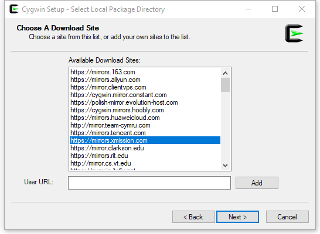

# Learn Cygwin / Install Cygwin #

Cygwin is installed by running a setup program that provides interactive installation options.
Cygwin provides many different programs and the setup program allows selecting programs from categories.
The more software is installed, the more functionality is available;
however, more disk space is required.
In general, installation should be limited to useful general utilities and programs that are needed specifically to accomplish a task.
The remainder of this page includes the following sections:

* [Download Cygwin Installer](#download-cygwin-installer)
* [Run the Cygwin Installer the First Time for the Initial Installation](#run-the-cygwin-installer-the-first-time-for-the-initial-installation)
	+ [Cygwin Packages to Install](#cygwin-packages-to-install)
* [Troubleshooting Install](#troubleshooting-install)
* [Updating Software](#updating-software)

--------------

## Download Cygwin Installer ##

Cygwin software is managed using a package approach and a setup program that downloads software packages from Cygwin mirror sites.
The Cygwin installer is available on the following website:

* [Cygwin](https://cygwin.com/install.html)

Select the setup program that is appropriate for the operating system.  For example, choose `setup-x86_64.exe` for Windows 64-bit.

* **Single user** - If the software will only be used by a single user, save the setup program to a location that is visible to that user,
such as `C:\Users\xxx\Downloads\cygwin\setup-x86_64.exe`.
* **Multiple users** - If the software will be used by multiple users on the computer that will be able to run the setup program,
save the setup program in a location that can be accessed by multiple users, such as `C:\Shared\Downloads\cygwin\setup-x86_64.exe.`
The setup program may need to be moved from the default Downloads folder for the user.

The setup program will need to be rerun to download Cygwin updates and new packages.
Installing in a shared location ensures that the multiple users on the computer will
be able to share the configuration information for later updates.

## Run the Cygwin Installer the First Time for the Initial Installation ##

Run the `setup*.exe` program that was downloaded.

**Note that the following documenation was created with a specific version of Cygwin and the install process may have changed.
The setup program does not tend to change much.**

**Note:  On one Windows 64-bit laptop the setup program displayed a Windows error message at the start and
end of running the setup program but the program kept running as shown below and seemed to work.
Running the program as administrator may avoid these errors.**

 
Press ***Next >*** to continue.

Press ***Next >*** to continue.  The root directory (below) is the directory under which all the Cygwin files will install.
The default shown below is the default and will be accessible by multiple users on the computer.
It is recommended to use the default.

Press ***Next >*** to continue.

Specify the package directory as shown above (this clearly indicates the 64-bit version) and press ***Next >***.
Specify the location as follows:

* **Multiple users on computer**:  If the software will be used by multiple users on the computer,
save the setup program to a location like:  `C:\Shared\Downloads\cygwin\setup-x86_64-setup-packages`.
* **Single user on a computer**:  If the software will only be used by a single user,
save the setup program to a location like:  `C:\Users\xxx\Downloads\cygwin\setup-x86_64-setup-packages`.

Accept the above defaults by pressing ***Next >***.  The next dialog (below) asks to select a mirror site.
A site close to the local computer should be selected for best performance.  The following link lists available mirror sites:

* [Cygwin Mirror Sites](https://cygwin.com/mirrors.html)

For example, the site selected above is for Colorado locations.   However, mirrors change over time.
Sites that have worked include the following, but sites need to be tested via the setup program:

* http://mirrors.kernal.org

Press ***Next >*** to continue.  The following dialog will then be shown to illustrate available packages.

### Cygwin Packages to Install ###

By default Cygwin will install core software packages.  Use the package tree to expand and select desirable packages.
Generally only the binary is needed.
The following are recommendend for consideration in a technical environment where software development
and data analysis are occurring.
Packages listed in bold are those recommended for minimal use,
for example someone using Cygwin for basic scripting and automation but not doing software development.
Packages can always be added later (see the [Updating Software](#updating-software) section).
After selecting packages to install press ***Next >*** to start the download.
The selected software and necessary dependencies will be installed.

**Note that some software can also be installed directly on Windows and it may be more appropriate to do so,
especially if a large software component that needs to directly integrate with Windows.
Windows command-line programs can be accessed from Cygwin if appropriate.  Examples include R, QGIS, databases.**

Recommended software include the following.  To list categories, select the ***Category*** view in the
***Select Packages*** window.
Some software is listed in multiple categories (e.g., Python is listed in ***Interpreters*** and ***Python***.

* Admin
* **Archive**
	+ **P7zip** - useful for compressing/uncompressing files
	+ zip - useful to zip `*.zip` files, if 7zip is not used
	+ **unzip** - useful to unzip `*.zip` files, has been known to work for some archives when 7zip does not
* Audio
* Base
* Database
	+ mysql (clients) – common open source database
	+ mysql-sever or mysqld (database) – common open source database
* Debug
* Devel – useful utilities for developers
	+ bashdb
	+ binutils
	+ gcc-core – C compiler
	+ gcc-fortran – Fortran compiler
	+ gcc-g++ - C++ compiler
	+ gcc-objc – objective C compiler (mobile devices)
	+ gdb
	+ git – Git version control (OK to use Git in Cygwin but need to configure the user properties, which live in the Cygwin user files
	separate from other Git client software installations)
	+ git-completion
	+ git-gui
	+ git-svn
	+ gitk
	+ gitweb
* Doc
* **Editors** (pick one or more depending on need and skill)
	+ **ed** – streaming editor for batch edits
	+ geany – GTK+ text editor and IDE (for development)
	+ gedit – alternative to scite
	+ **gvim** – graphical “vim”
	+ **hexedit** – hex editor for binary files
	+ **nano** – interactive editor (visual), often used for examples when working with Linux
	+ pluma – alternative to scite
	+ scite – GTK+ Scintilla-based Text Editor (seems to have some external dependencies that you may not want/need to install – just say “OK” to continue during the installation process)
	+ **vim** – “vi” improved modal editor (terminal), useful to know when accessing remote Linux systems by terminal session only
* Games
* GNOME
* Graphics
	+ gnuplot – scientific plotting
	+ proj
* Interpreters
	+ **idle** – interactive development environment for Python
	+ **idle3** – interactive development environment for Python
	+ perl
	+ php – for server-side web development in Apache
	+ php-devel
	+ **python** - Python 2
	+ **python-tkinter** - for Python 2
	+ **python3** - Python 3
	+ **pytyon3-tkinter** - for Python 3
	+ ruby
	+ ruby-doc
	+ ruby-tcktlk
* KDE
* Libs
* Lua
* Mail
	+ email (similar to Linux “mail” program)
	+ mutt – email client (mail user agent, MUA)
	+ postfix, postfix-doc – mail transfer agent (MTA, sendmail alternative)
	+ sendmail – legacy mail transfer agent
* MATE – provides integrated desktop with applications, newer continuation of GNOME, comes with compatible applications like editor and file browser
* Math
	+ gnuplot - (if not picked above), scientific plotting
	+ octave – like matlib but open source
	+ R - statistics
	+ units – units conversion
* Net
	+ bind-utils – for DNS internet address tools such as “dig”
	+ **curl**
	+ openssh – for remote computer access
	+ ping
	+ putty
	+ rsh
	+ rsh-server
	+ rsync
* Ocaml
* Perl
	+ perl (if not selected above)
* PHP
	+ apache2-mod_php5
	+ php (if not selected abov)
* Publishing
* Python
	+ see previous selections above
	+ **python** - Python 2
	+ **python3** - Python 3
	+ **python3-pyqt5** - needed for Python graphical user interface programs
	+ python3-... - other Python 3 packages may be needed by other software used with Cygwin
	+ pylint
* Ruby
	+ see previous selections above
* Scheme
* Science
	+ gdal – for spatial data processing
	+ python-gdal – python GDAL integration
* Security
* Shells
	+ **bash**
	+ **bash-completion**
	+ **mintty**
	+ **rxvt-unicode (maybe minty is enough?)**
* System
* Tcl
* Text
	+ ascii
	+ **flip** - see also Utils/dos2unix
	+ xlsx2csv
	+ xmlto
* Utils
	* code2html
	* colordiff
	* copyright-update
	* ddir
	* **diffutils**
	* **dos2unix**
	* tree
	* wdiff
* Video
* Web
	+ apache2 (may not be listed?)
	+ httpd (all Apache HTTP server and mod files – leave out what is not needed)
	+ httperf
	+ httping
	+ linklint
	+ lynx
	+ micro-httpd
	+ ruby-rails
	+ ruby-rails-doc
	+ webcheck
	+ **wget**
	+ **wput**
* X11 – X Windows environment (may be needed if Linux virtual machine is not available and want to use Cygwin as display for remote logins)
	+ tcl-tk – scripting tool to program user interfaces
	+ **xclock** – useful to test whether X Windows is properly configured
	+ xdpyinfo – for checking display information
	+ **xinit** – program to initialize X Windows sessions (includes startxwin, needed to start the X Window server)
	+ xkill – kill X Windows programs and free resources
	+ xload – program to display system load
	+ **xorg-server** – X Windows server, needed to run graphical user interface software, such as Python UI programs
	+ xmore – graphical “more” to page text files
	+ xpdf – PDF viewer
* Xfce

After selecting software to install, press ***Next >*** to continue.
Note that it is possible to install only single programs or multiple selections and repeat these steps.
The installation process can take awhile so it may be helpful to complete these steps and work on other things while the install runs.
Depending on what was selected, additional dependencies may be needed:

Press ***Next >*** to continue downloading, including dependences.  The download process will start and will likely run for quite a while the first time.

A warning might be shown like the following.  Take a note in case the component is actually needed but it may not be necessary for software that is used.
Library dependencies tend to be more of an issue with graphical programs such as editors and can be installed separately if the initial attempt fails.
Press ***OK*** to continue.

At the end of the installation, there will be a prompt to add icons to the desktop and start menu.
Adding to the menu is recommended and a desktop icon is convenient for starting shells.
See the [User Environment](../user-env/user-env) section for additional information about user environment configuration.

## Troubleshooting Install ##

An error will sometimes be shown that an error has occurred during installation.
It may be possible to continue at the current step or sometimes the setup program must be rerun.
Worst case, choices may need to be selected again.

A common issue is that the Cygwin team updates the setup program.
The following warnings indicate that this has happened.
The solution is typically to download the latest setup program from the Cygwin website as described at the beginning
of this page, and then perform setup steps as usual.

## Updating Software ##

After using Cygwin it may become obvious that a software package is missing.
 To add a package, rerun the setup program and select additional packages for installation.

To update a package, rerun the setup program to automatically check for updates.
