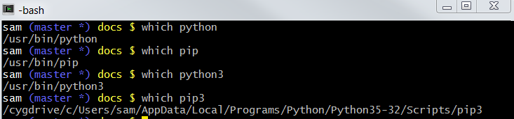

# Learn Cygwin / Troubleshooting #

The following issues may occur.

* [Permission error trying to install Python packages](#permission-error-trying-to-install-python-packages)

---------

## Permission error trying to install Python packages ##

A permissions error may be shown trying to install Python packages.
This may be due to the user not having permissions to write to the installation folder.

First, make sure that the expected Python is actually being used by running `which python`, which should
indicate something like the following:

If Python software locations are not similar to the above and are instead located under
Windows software folders, then the software should probably be installed on Windows.
Cygwin will then find the Windows software to run.

If Python is installed on Cygwin, then `pip` or `pip3` can be used to install packages.
To overcome the permissions issue, right click on the Cygwin terminal icon on the desktop
(assuming Cygwin was allowed to add an icon to the desktop) and select
***Run as Administrator***.
This will open a Cygwin terminal suitable for administrator (root in Cygwin).
An alternative is to right-click on the ***Cygwin / Cygwin64 Terminal*** menu (or similar) in the start menu.
Then run the `pip` command need to install the Python package.

**Make sure that the software that is being installed is from a trusted source.**
