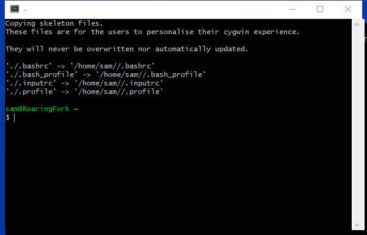

# Learn Cygwin / User Environment #

The Cygwin user environment provides a convenient environment for performing computing tasks,
including software development and process automation.  See the [Using Cygwin Command Line](../using-cygwin-cl/using-cygwin-cl) section
for information about starting a command line terminal window.

In the following discussion the tilde (`~`) is used to indicate the home folder.
Therefore a hidden file in the user's home folder would be indicated by `~/.theFile`,
where the leading period by default indicates hidden files on Linux (file will be visible on Windows unless its hidden attribute is set).

The remainder of this page includes the following sections:

*   [First Terminal Session](#first-terminal-session)
*   [Basic Environment Information](#basic-environment-information)
*   [Settings for `mintty` Terminal](#settings-for-mintty-terminal)
*   [Settings for `rxvt` Terminal](#settings-for-rxvt-terminal)
*   [Shell Configuration](#shell-configuration)
*   [`vim` Editor Configuration](#vim-editor-configuration)

---------

# First Terminal Session #

The first terminal session that is opened with the ***Cygwin64 Terminal*** desktop icon or ***Start*** menu
may show information similar to the following.



The indicated files are the primary files that should be modified to customize a user's environment.

*   `.bash_profile` - is executed for for login shells (such as Cygwin terminal)
*   `.bashrc` - is executed for interactive non-logic shells and when running a shell script
    (this file is typically "sourced" by `.bash_profile`
*   `.inputrc` - [Readline library initialization file](https://www.gnu.org/software/bash/manual/html_node/Readline-Init-File.html)
*   similar to `.bash_profile`, but used with the `sh` shell script

Typing `ps` in the terminal window will list processes.
The `bash` shell will be shown as the default shell being used and therefore `.bash_profile` and `.bashrc` apply.

Additional configuration of the user environment can occur by modifying the above, and other hidden files.
**Need to put examples here of common things that might be done.**

## Basic Environment Information ##

The following is basic environment information for user files:

*   The user's home folder if Cygwin is installed under `C:\cygwin64` will be `C:\cygwin64\home\username`.
*   The user's home folder when in a Cygwin terminal is `/home/username`.
    +   `pwd` will show `/home/username`.
*   The Windows C drive is accessed as `/cygdrive/C` or `/cygdrive/c`.  Other drives can be accessed similarly.
*   The user's home folder using Windows drive and folders convention is `/cygdrive/C/Users/WindowsUser`.
    +   `cd C:/users/username` is also accepted but `pwd` will show `/cygdrive/c/users/username`.

**Cygwin `/home/username` user files are not in the same location as Windows files.
To avoid confusion, use `cd /cygdrive/c/Users/username` to access Windows user files.** 

The `PATH` environment variable is initialized to the Windows `PATH` variable but with `/cygdrive` inserted as appropriate
and with important Cygwin software folders added.
This allows Cygwin and Windows software to be run from a Cygwin shell.

## Settings for `mintty` Terminal ##

Cygwin by default uses the `mintty` program for the terminal window.
This can be confirmed by checking the processes that are running:

```sh
sam (master *) docs $ ps
      PID    PPID    PGID     WINPID   TTY         UID    STIME COMMAND
I    8880   12996    8880      13072  pty1        1001   Nov  3 /usr/bin/bash
     4664    9712    4664       4972  pty0        1001 12:32:18 /usr/bin/ps
S   10472    9712   10472       5812  pty0        1001 21:13:23 /usr/bin/vim
S    4200    9712    4200      13308  pty0        1001 09:29:10 /usr/bin/vim
     9712   12564    9712      13116  pty0        1001   Nov  3 /usr/bin/bash
    11740   10144   10144       7356  pty2        1001 21:06:18 /usr/bin/python2.7
    12996       1   12996      12996  ?           1001   Nov  3 /usr/bin/mintty
      624       1     624        624  ?           1001 21:01:45 /usr/bin/mintty
S    6976    9712    6976      11044  pty0        1001 10:01:00 /usr/bin/vim
    12776     624   12776       9132  pty2        1001 21:01:45 /usr/bin/bash
    10144   12776   10144      11080  pty2        1001 21:06:18 /usr/bin/sh
    12564       1   12564      12564  ?           1001   Nov  3 /usr/bin/mintty
```

Working in a terminal window with the `vim` editor can be difficult because the cursor may show as a faint vertical line.
To configure `minty` settings, add a `~/.minttyrc` file.  The following will set the cursor to a yellow block:

```text
BoldAsFont=no
CursorColour=255,236,0
CursorType=block
Additional Environment Configuration
```

## Settings for `rxvt` Terminal ##

Cygwin by default uses the `mintty` program for the terminal window, as discussed above.
However, the `rxvt` terminal window also is a useful interface to the Cygwin command line
and may be preferred to `mintty` (or may be the only option for older Cygwin installations).
`rxvt` [may be is missing from the Cygwin distribution (check this list)](https://www.cygwin.com/cygwin-64bit-missing),
and therefore the default `mintty` seems to be the best option.
Through experience, the following command line is useful with `rxvt`, such as for desktop shortcut to open a terminal:

```
C:\cygwin\bin\rxvt.exe -sl 500 -fn "fixedsys" -fg white -bg black -e /bin/bash –login
```

## Shell Configuration ##

It is useful to configure the Cygwin environment to allow for more efficiency.
For example, aliases can be defined in the shell.
Edit the `~/.bashrc` and uncomment or define new aliases
(the alias for `ls`, `la`, `ll` in the default `.bashrc` file can be uncommented to enable).
A useful alias to use the more visual `vim` editor is as follows, if `vim` has not already replaced `vi` by default:

```
  alias vi=vim
```

## `vim` Editor Configuration ##

To configure the vim editor to color files, add the following at a minimum to the `~/.vimrc` file:

```text
" Turn colored formatting on
:syntax on

" Color scheme
" To pick from available list do:
" :colorscheme _space_ Tab
" Reasonable options seem to be:  koehler, murphy, elford
:colorscheme koehler

" Ignore case when searching
set ic
```

Note that any changes in configuration require opening a new terminal window to recognize
(or run:  `source ~/.bashrc`).
