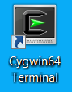
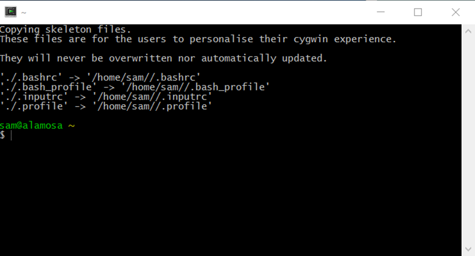

# Learn Cygwin / Using Cygwin Command Line #

The Cygwin command line is accessed using a terminal window and provides access to command line programs including the shell.
The command line interface facilitates creating and running scripts to automate processes.

See also the [Using Cygwin X Windows](using-cygwin-xwin) section for information about running graphical user interface programs.

## Start Terminal from Desktop Icon ##

The Cygwin installation process will give the option of configuring a desktop icon.
On Windows 7 the desktop icon looks like the following:

## Start Terminal from Start Menu ##

To start a Cygwin terminal from the ***Start*** menu, use ***Cygwin / Cygwin64 Terminal*** (for example).

## Terminal Command Line ##

The first time that a Cygwin terminal is opened will result in some automatic setup, as shown in the following:

Opening a terminal for the first time creates the user `/home/username` folder, using the Windows login name.

Once a terminal is open, installed programs can be run by typing their name.
Additional configuration of the user environment is discussed in the [User Environment](user-env) section.
