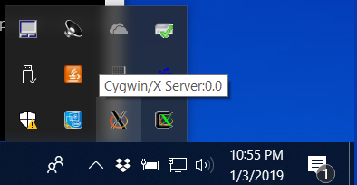
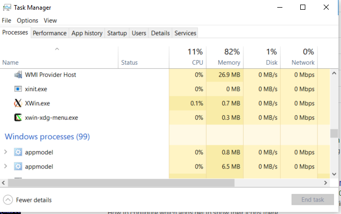

# Learn Cygwin / Using Cygwin X Windows#

Cygwin includes optional software to run the X Windows windowing environment found on Linux.
X Windows is a technology that interfaces software programs with the operating systems' graphical resources.
Installing and enabling X Windows can also allow display on the local computer of
programs running on remote systems.

An example of X Windows programs are Python scripts that use the Qt5 windowing packages.
The [Open Water Foundation GeoProcessor](http://learn.openwaterfoundation.org/owf-app-geoprocessor-python-doc-user/)
software is an example of such software.

*   [Install X Windows Software](#install-x-windows-software)
*   [Starting the X Windows Server](#starting-the-x-windows-server)
*   [Running X Windows Programs](#running-x-windows-programs)

-------------------

## Install X Windows Software ##

To use X Windows, make sure to install necessary X11 software as indicated in the
[Installation Section](../install/install#cygwin-packages-to-install).

## Starting the X Windows Server ##

In order to run X Windows software, the X Windows server software must be run.
The server only needs to be started once.
The X Windows server can be started manually via the ***Start / Cygwin-X / XWin Server*** menu.
Once started, the server process will be indicated with an icon in the ***System Tray*** at the bottom of the desktop,
as shown as the "X" icons in the following image.  Note the server display information `:0.0` in the image.



The Windows ***Task Manager*** can be run and will list the X Windows server processes as shown in the
following figure (see `xinit.exe`, `XWin.exe`, and `xwin-xdg-menu.exe` processes).



Once the X Windows server is running,
programs that use X Windows graphics can communicate with the server to display graphical output.

## Running X Windows Programs ##

A program that uses X Windows must set the `DISPLAY` environment variable,
which indicates to the X Windows server the window on which the application should display.
Typically this is done by running a Cygwin terminal and setting the environment variable in that window,
for example:

```
$ export DISPLAY=":0.0"
```

To minimize the need for software users to deal with X Windows server configuration,
a shell script can be used to configure the environment and run software.
For example, the following script is used to run the Open Water Foundation GeoProcessor
(see the [source code in GitHub](https://github.com/OpenWaterFoundation/owf-app-geoprocessor-python/blob/master/scripts/gp)):

```
# Set the DISPLAY variable needed for X windows
checkXWindowsDisplay() {
    if [ -z "$DISPLAY" ]; then
        # DISPLAY environment variable is not set so set it
        # - assume running X server and program on one computer
        echo "Setting DISPLAY=:0.0 to work with X Windows server"
        export DISPLAY=:0.0
    else
        # DISPLAY already set
        echo "Using DISPLAY=$DISPLAY for X Windows server."
    fi
}

# Check to make sure the X Windows Server is running
# - currently only check on Cygwin since if running on Linux X Windows is usually running
# - if the check is not performed and X Windows server is not running, will probably see:
#   "Could not connect to any X display"
checkXWindowsServer() {
    if [ ${operatingSystem} = "cygwin" ]; then
        # Check for XWin process
        xwinProcess=$(ps | grep -i XWin)
        if [ -z "${xwinProcess}" ]; then
            echo ""
            echo "It appears that the X Windows server is not running on Cygwin."
            xserverPath="/cygdrive/C/ProgramData/Microsoft/Windows/Start Menu/Programs/Cygwin-X/XWin Server.lnk"
            if [ -f "${xserverPath}" ]; then
                # Windows shortcut exists in the normal location.
                # Run it to start the X Windows server
                echo "Starting X Windows server by running:"
                echo "  cygstart ${xserverPath}"
                # See the following about running a Windows shortcut from Cygwin:
                # https://superuser.com/questions/790128/cygwin-to-execute-windows-shortcut-files-lnk
                cygstart "${xserverPath}"
                # Have to wait a bit for the X Windows server to start
                # - Loop for 10 seconds and if that is not enough continue and see what happens
                startSeconds=$(date +%s)
                while [ "1" = "1" ]; do
                    # Sleep 1 second to give X Windows server time to start
                    sleep 1
                    # See if the X Windows server process is found
                    xwinProcess=$(ps | grep -i XWin)
                    if [ ! -z "${xwinProcess}" ]; then
                        # X Windows server process is found
                        break
                    else
                        # See if 10 seconds has passed and if so break, assuming process won't start
                        nowSeconds=$(date +%s)
                        timediff=$(expr $nowSeconds - $startSeconds)
                        if [ "${timediff}" -gt "10" ]; then
                            break
                        fi
                    fi
                done
                echo "If still get errors, try starting manually with Start / Cygwin-X / XWin Server"
            else
                echo "Cannot determine how to automatically start the X Windows Server"
                echo "If get an error running GeoProcessor, try starting X Windows server manually with Start / Cygwin-X / XWin Server"
            fi
        fi
    fi
}
```
